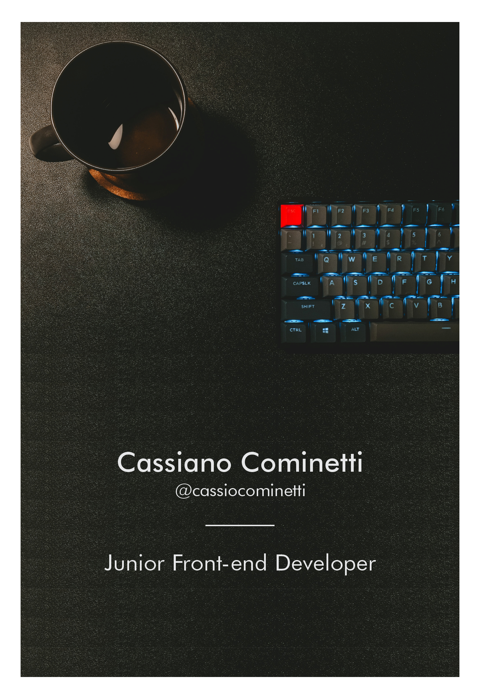

<h1 align="left">Hi , I'm Cassiano Cominetti</h1>

- 🔥 Junior Front-end Developer.

- 🔭 I’m currently working as Junior Front-end Developer, freelance helping Senior Full-stack Developers, and also local tech companies, with daily tasks.
     I have different levels of expertise in front-end development technologies, encompassing HTML, CSS, JavaScript, TypeScript, Tailwind CSS, React.JS, Axios, Formik, Yup, Jira, Git, GitFlow, and others.

- 🔭 Worked on improving and enhancing the accuracy of artificial intelligence models through data annotation and analysis for highly relevant large language models (LLM), ensuring the quality of data feeding the system and continuously improving its performance. Key projects included the Llama (Large Language Model Meta AI) and the Meta AI conversational assistant.

- 💬 I can speak Portuguese, Spanish, English, and I am currently studying Italian. 

- ⚡ Fun fact - My name is Cassiano, but my mom, family and friends call me Cassio. Feel free to choose.

 

## Contact

